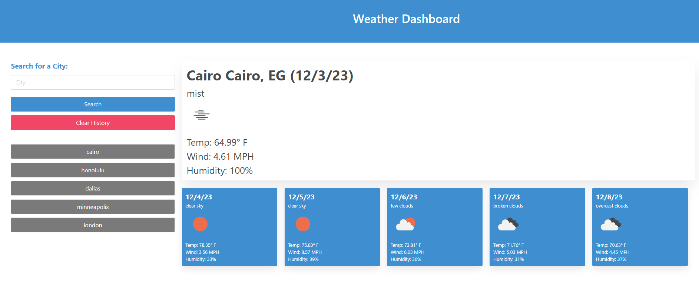

# 06-weather-dashboard
html, css and js for weather dashboard

## Usage
Search bar allows searching for a city.  
Current and 5 day weather forecast should appear if city is found.  
Cities searched successfully will be saved in local storage and displayed below search bar.  
Clicking on a history link will display the weather for that location.

https://treblotnad.github.io/06-weather-dashboard/

## License

Please refer to the License in the repo.